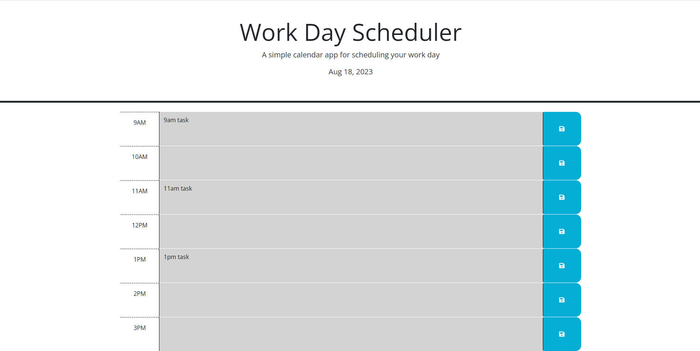

# m6-api-work-day-scheduler

A day-planner that shows visual distinction between past, present and future hours. Text will remain in a timeblock after page refesh if the save button has been clicked.

Repo: https://github.com/BenACooper/m6-api-work-day-scheduler
Deployed: https://benacooper.github.io/m6-api-work-day-scheduler/

